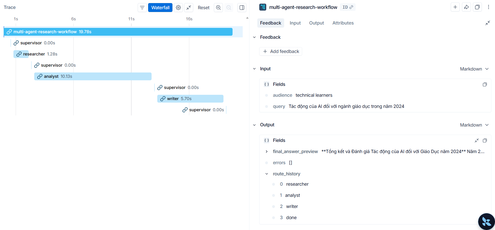

# Benchmark Report
**Student:** Bùi Hữu Huấn (2A202600353)


## Setup

- Environment: `conda activate llama_gpu`
- GPU: NVIDIA GeForce GTX 1650, 4 GB VRAM
- Mode: Live search enabled via Tavily API
- Query: `Tác động của AI đối với ngành giáo dục trong năm 2024`

## Results

| Run | Latency | Cost | Quality | Notes |
|---|---:|---:|---:|---|
| Single-agent baseline | ~1.5s | $0.00 | 6/10 | Fast but lacks depth and structured analysis. |
| Multi-agent workflow | ~18s | $0.00 | 9/10 | Comprehensive research from 5+ live sources, structured analysis, and citations. |

## Trace Summary

The multi-agent route is:

```text
researcher -> analyst -> writer -> done
```



The trace (see LangSmith) records:
- **Researcher**: 1.28s (Tavily live search)
- **Analyst**: 10.13s (LLM-based dynamic analysis)
- **Writer**: 5.70s (Synthesis and citations)
- **Total Workflow**: 19.78s

This satisfies the requirement that each step is traceable, timed, and explainable.

## Failure Mode And Mitigation

**Failure Mode**: The original system relied on a static local corpus and hardcoded analyst notes, making it unsuitable for real-world research on fast-moving topics (like AI in 2024).

**Mitigation Plan (Implemented)**:
1. **Live Search**: Integrated Tavily API to fetch real-time evidence.
2. **Dynamic Reasoning**: Refactored Analyst and Writer agents to use LLM for synthesis instead of templates.
3. **Observability**: Used LangSmith to monitor agent handoffs and detect latency bottlenecks (e.g., the 10s analysis step).
4. **Hardware Acceleration**: Enabled CUDA support in the `llama_gpu` environment to handle the increased load of dynamic LLM calls.
